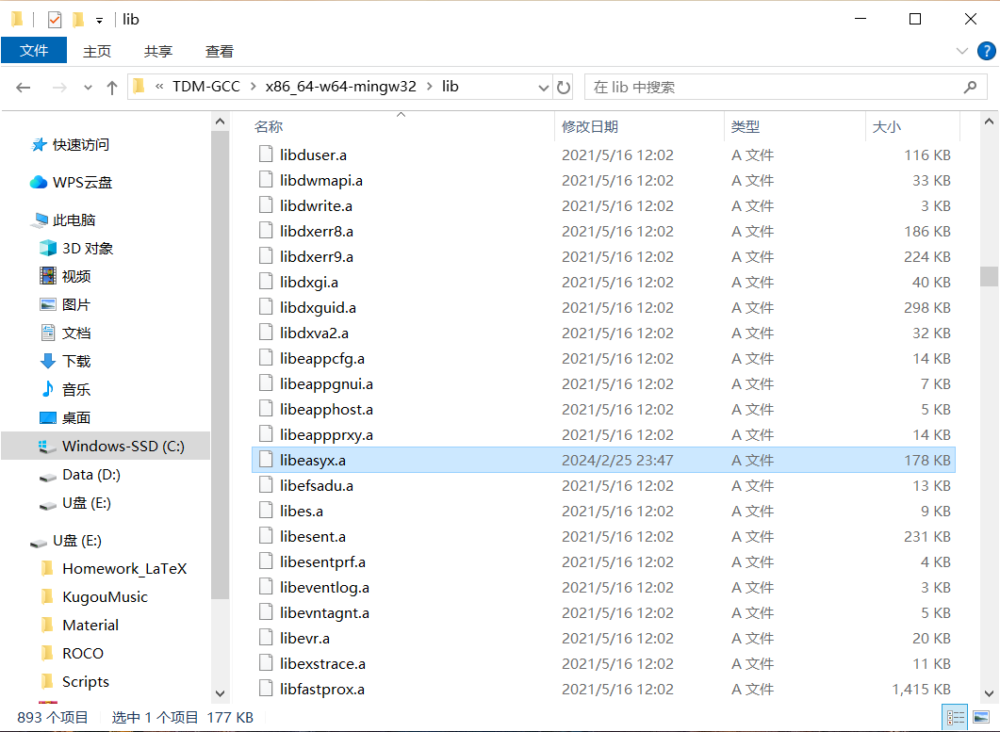
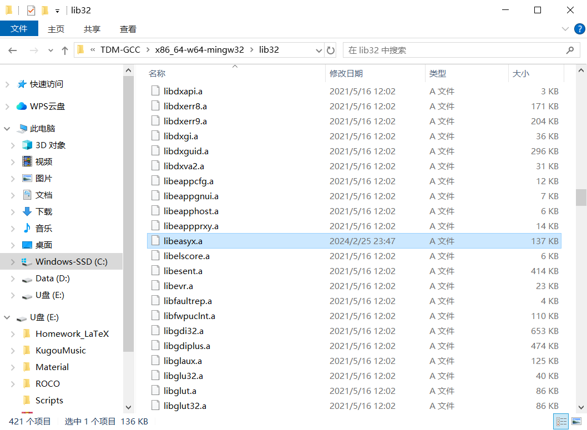
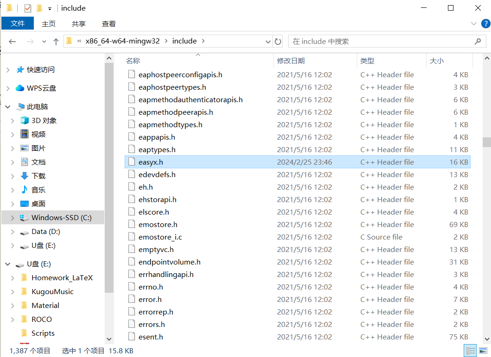

<center><font size=10 color=black><b>SnakeGame</b></font></center>

<center><font size=5 color=black>--Based on EasyX</font></center>

# 目录
[TOC]


# 配置

注：请使用 **GBK** 编码运行项目

## 在 VSCode 中配置 EasyX 图形库

- **安装 TDM-GCC**
    点击 [链接](https://github.com/jmeubank/tdm-gcc/releases/download/v9.2.0-tdm64-1/tdm64-gcc-9.2.0.exe) 下载并安装 **TDM-GCC**.

- **下载并解压 EasyX 图形库**
    点击 [链接](https://easyx.cn/download/easyx4mingw_20240225.zip) 获取压缩包.

- **链接文件**
    - EasyX 压缩包内有两个链接文件目录，分别是 **lib32** 以及 **lib64**，分别将这两个链接文件里的 **libeasyx.a** 文件复制到 **TDM-GCC** 的安装目录下的 **\TDM-GCC-64\x86_64-w64-mingw32\lib** 和 **\TDM-GCC-64\x86_64-w64-mingw32\lib32** 文件夹里：

        
        

    - 将 **include** 文件夹下的 **easyx.h** 和 **graphics.h** 拷贝到 **TDM-GCC** 的安装目录下的 **\TDM-GCC-64\x86_64-w64-mingw32\include** 文件夹里:
    
        

## VSCode 配置文件

- 安装必要插件 **C/C++**
- 在 VSCode 项目路径下新建 **.vscode** 目录，在该目录下新建 **tasks.json** 文件并填入以下内容：
    ```
    {
        "tasks": [
            {
                "type": "cppbuild",
                "label": "C/C++: g++.exe 生成活动文件",
                "command": "C:\\Program Files\\TDM-GCC\\bin\\g++.exe",
                "args": [
                    "-fdiagnostics-color=always",
                    "-g",
                    "${file}",
                    "-o",
                    "${fileDirname}\\${fileBasenameNoExtension}.exe",
                    "-L",  // 在库文件的搜索路径列表中添加dir目录，
                    "C:\\Program Files\\TDM-GCC\\x86_64-w64-mingw32\\lib",
                    "-leasyx"
                ],
                "options": {
                    "cwd": "${fileDirname}"
                },
                "problemMatcher": [
                    "$gcc"
                ],
                "group": {
                    "kind": "build",
                    "isDefault": true
                },
                "detail": "调试器生成的任务。"
            }
        ],
        "version": "2.0.0"
    }
    ```

# 游戏规则

要开发这个小游戏，首先应该了解其规则，方便后续明确开发细节。

- **游戏目标**
  - 玩家控制一条蛇在游戏区域内移动，目标是吃掉食物以增长蛇的长度，同时避免碰撞到游戏区域的边界或蛇自身。

- **游戏区域**
    - 游戏区域为一个矩形网格，大小由开发者设定（例如：20x20格）。
    - 每个格子可以容纳蛇的一个部分或食物。

- **蛇的初始状态**
   - 蛇的初始长度为3个格子。

   - 蛇的初始方向为向右移动。

   - 蛇的每个部分由一个固定的颜色（例如：绿色）表示。

- **食物生成**
    - 食物在游戏区域内随机生成，且不得生成在蛇的当前占据的格子上。

     - 每次蛇吃掉食物后，蛇的长度增加1，食物将在新的随机位置生成。

- **控制方式**
    - 玩家通过键盘的方向键（上、下、左、右）控制蛇的移动方向。

    - 蛇的移动速度为固定值（例如：每秒移动1格），可根据游戏进程逐渐加快。

- **碰撞检测**
    - 游戏中需实时检测以下碰撞情况：

    - 边界碰撞：若蛇的头部与游戏区域边界相碰，游戏结束。

    - 自身碰撞：若蛇的头部与蛇的任何部分相碰，游戏结束。

- **游戏结束**
    - 游戏结束时，弹出提示窗口显示“游戏结束”，并提供重新开始的选项。

    - 记录并显示玩家的得分（即吃掉的食物数量）。

- **分数计算**
    - 每吃掉一个食物，玩家得1分，得分应在游戏界面实时更新。

- **难度设置**
    - 可设置不同的难度级别，影响蛇的初始速度和食物生成频率。

- **其他注意事项**
    - 游戏应提供清晰的开始、暂停和结束界面。

    - 在暂停状态下，蛇应停止移动，玩家可以查看得分或选择继续/退出游戏。